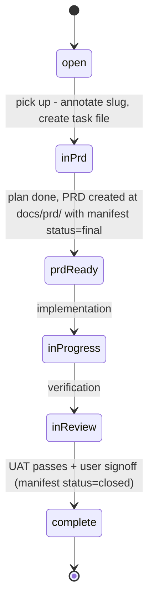

# System Architecture Overview

## Architectural Model

The workspace follows a **centralized inference hub with multiple downstream consumers** pattern:

```
                        ┌─────────────────────┐
                        │   headroom-pi        │
                        │   (compression       │
                        │    proxy on :8787)   │
                        └────────┬────────────┘
                                 │ routes through
                                 ▼
┌─────────────────────────────────────────────────────┐
│              LLM Inference Server (llm/)             │
│              Flask app on :8012                      │
│              ┌──────────────────────────────────┐   │
│              │  Router → Provider (gemma_e2b,   │   │
│              │           OpenAI-compatible,      │   │
│              │           llama.cpp subprocess)   │   │
│              └──────────────────────────────────┘   │
│  Services: /v1/chat/completions, /metrics, /health  │
└────────────┬────────────────────────────────┬───────┘
             │ HTTP inference                  │ HTTP inference
             ▼                                ▼
┌────────────────────────┐   ┌──────────────────────────┐
│ survival-infrastructure│   │    feed_analyser          │
│ (Flask :5051)          │   │    (FastAPI :8000)        │
│                        │   │                           │
│ Pipeline: capture →    │   │ Pipeline: ingest →        │
│ extract → people/wiki  │   │ classify → scout          │
│ Via: llm_client        │   │ Via: llm_client           │
│ workflows.yaml         │   │ workflows.yaml            │
└────────────────────────┘   └──────────────────────────┘

┌──────────────────────────────────────────────────────┐
│ workspace-portability                                 │
│   Phase 1: magic-setup → bootstrap-orchestrator       │
│   Phase 2: setup-guide → secrets, assets, services    │
│   Backup: create-all-snapshots → GDrive + GitHub      │
└──────────────────────────────────────────────────────┘
```

## Shared Infrastructure

### Container Runtime

- **Podman** is the default runtime across all projects.
- **Docker** remains a supported fallback (set `CONTAINER_RUNTIME=docker`).
- A shared external network `workspace-shared-llm-network` connects containers across projects.

### LLM Client Package

The `llm-client` pip package (source in `/llm/llm_client/`) provides a uniform `WorkflowClient` that both downstream apps consume:

- [survival-infrastructure](/openwiki/projects/survival-infrastructure.md) uses it for extraction, wiki synthesis, and event parsing
- [feed_analyser](/openwiki/projects/feed-analyser.md) uses it for tweet classification and scouting

Both apps own a per-project `config/workflows.yaml` that defines model references, system prompts, temperature, and fallback functions. The client code is identical across projects.

**Known issue:** The `llm_client` package is currently served via PYTHONPATH volume mount rather than being baked into container images. See [KNOWN_ISSUES.md](/docs/KNOWN_ISSUES.md).

### Data Flow

```
[User captures events] → survival-infrastructure POST /api/captures
    ↓ raw_captures.jsonl
[Extraction job enqueued] → POST /api/extractions
    ↓ LLM inference via llm_client → llm/ server
[Structured events] → events/ev_<id>.json
    ↓
[People / Wiki synthesis] → post LLM inference
    ↓
[Markdown wiki pages] → data/wiki/people/, data/wiki/topics/
```

```
[Twitter feed] → browser console scraper / headless scraper
    ↓ raw JSON → backend/raw_data/
[Ingestion pipeline] → API sync → SQLite classification
    ↓ LLM inference via llm_client → llm/ server
[Classified + scored posts] → database → UI dashboard
```

### Agent Skills

The workspace defines agent skills under [/.agents/skills/](/openwiki/reference/agent-config.md):

- **ssh-themistocles** — SSH connection to a secondary Debian machine with tmux-based resilience
- **survival-infrastructure-operation** — Full Makefile-driven ops for the pipeline app
- **product-layer** — Operates the software factory's [product/architecture layer](/openwiki/projects/software-factory.md): grills requirements, runs the task-similarity/merge check, produces plan documents, tracks tasks
- **eval-ops** — Run contract for the evaluator agent (continuous quality verification over factory loops: decision-record, task state-machine, knowledge, PRD/review, drift, context-engine, roster, repo-hygiene). See [Software Factory](/openwiki/projects/software-factory.md).

## Evaluation Infrastructure

The factory now includes a dedicated **evaluation department** (decision 02/03) that runs continuous quality verification over the factory's own loops. The evaluator agent (`.pi/agents/evaluator.md`, `.agents/skills/eval-ops/SKILL.md`) is a read-only worker that runs eval panels via the eval spine (`bin/eval-*.py`), emitting fixed-schema reports to `docs/evaluations/` and Langfuse scores.

**Live surfaces** (register: `docs/evaluations/surfaces.md`):
- **S1** decision-record loop (depth passes)
- **S2** task loop (state-machine PASS/FAIL)
- **S3** knowledge loop (tooling + orphan-decision index)
- **S4** PRD/review loop (P4–P7 review-loop guards)
- **S5** drift/L2 (fixes hold, 13 gold rows)
- **S7** context-engine (footprint + reachability + fidelity)
- **S8** roster-completeness
- **S9** repo-hygiene (langfuse keys = accepted-risk advisory)

S10 (app family) deferred until app preflights clear.

See [Operations & Infrastructure](/openwiki/operations/infrastructure.md) for details.

### Software Factory Components

The factory now has **five components** (see [Software Factory](/openwiki/projects/software-factory.md)):

| Component | Role | Canonical location |
|-----------|------|--------------------|
| **context_engine** | Infrastructure spine; every other component reads/writes it. Progressive disclosure keeps agents lean — context loads on demand, never pre-loaded. The knowledge base (`docs/knowledge/`) is the last stop. | `docs/factory-context.md`, `docs/knowledge/` |
| **product/architecture** | The UX layer; the only surface the user interacts with. Produces one artifact per task: a plan document that accumulates Product Design / System Architecture / Program Design sections based on task size. Invoked via the `product-layer` skill. | [`/.agents/skills/product-layer/SKILL.md`](/openwiki/reference/agent-config.md) |
| **project_management** | Prioritisation + lifecycle tracking: task dashboard, task files (`docs/tasks/<slug>.md`), lifecycle state machine, and automated bookkeeping. | `docs/tasks.txt`, `docs/tasks/`, `bin/transition-task.sh` |
| **assembly_line** | CI/CD, agents, sandboxes, testing. Staffed by three sub-agents: **prd-reviewer** (PRD gating), **implementer** (build → PR), and **code-reviewer** (post-implementation review), orchestrated headless by the GitHub Actions workflow **`factory.yml`**. | `bin/implementer-run.sh`, `bin/review-run.sh`, `bin/factory-run.sh`, `bin/sanitize-session.sh`, `.github/workflows/factory.yml`, `.pi/agents/`, `config/implementer.json`, `config/reviewer.json` |
| **evaluation** | Continuous quality verification. Cross-cutting, read-only: runs eval panels over the factory's own loops using the eval spine (session/trace → artifact → gold check → Langfuse panel). Emits `docs/evaluations/<date>-*.{json,md}` reports + Langfuse scores, never mutates a target repo. Staffed by the **evaluator agent** (`.pi/agents/evaluator.md` persona, run contract `.agents/skills/eval-ops/SKILL.md`). Artifact map: `docs/reference/evaluator-agent.md`. Report home + index: `docs/evaluations/`. | `bin/eval-*.py`, `docs/evaluations/`, `.pi/agents/evaluator.md`, `.agents/skills/eval-ops/SKILL.md` |

### Typed-Trail Integrity

Completed via task `typed-trail-integrity` (PR #46/#47). Three linked changes make the context engine's disclosure trail machine-followable by construction:

1. **Stable PRD home (Direction C)** — PRDs never move; lifecycle is `manifest.status` in `docs/prd/manifest.json`.
<!-- openwiki: broken internal link [../relative/path.md] file "../relative/path.md" does not exist. Fix the href or restore the target, then delete this comment. -->
2. **Typed relative links** — Cross-references are `[text](../relative/path.md)` resolved from the artifact's own location. Front-matter fields `Task`, `Session`, `Decisions` become links; `Status` links to the manifest row.
3. **Decision read-skip summaries** — All 122 decision files now carry a `**Summary**:` line (backfilled from Context/Rationale).

Hygiene enforcement: `bin/eval-hygiene.py` extended with three typed-trail checks (string-path presence, summary presence, stale/mismatch citation) — each falsifiable via demonstrated mutation injection.

## Software Factory Architecture

The software factory is a five-component system that governs all development in this workspace:

```
┌─────────────────────────────────────────────────────────────────────────┐
│                        SOFTWARE FACTORY                                 │
├─────────────────────────────────────────────────────────────────────────┤
│                                                                         │
│  ┌──────────────────┐    ┌──────────────────┐    ┌──────────────────┐  │
│  │  context_engine  │◄───│ product/arch     │───►│ project_mgmt     │  │
│  │  (infrastructure │    │  (UX layer,      │    │  (tasks.txt,     │  │
│  │   spine,         │    │   product-layer  │    │   task files,    │  │
│  │   knowledge)     │    │   skill)         │    │   transitions)   │  │
│  └────────┬─────────┘    └────────┬─────────┘    └────────┬─────────┘  │
│           │                       │                       │            │
│           └───────────────────────┼───────────────────────┘            │
│                                   ▼                                    │
│                    ┌──────────────────────────┐                        │
│                    │     assembly_line        │                        │
│                    │  ┌────────────────────┐  │                        │
│                    │  │  prd-reviewer      │  │  (PRD gating gate)    │
│                    │  │  implementer       │  │  (build → PR)         │
│                    │  │  code-reviewer     │  │  (PR → report)        │
│                    │  │  evaluator         │  │  (continuous eval)    │
│                    │  └────────────────────┘  │                        │
│                    │  Orchestrated by:        │                        │
│                    │  bin/factory-run.sh      │                        │
│                    │  .github/workflows/      │                        │
│                    │  factory.yml             │                        │
│                    └──────────────────────────┘                        │
│                                                                         │
└─────────────────────────────────────────────────────────────────────────┘
```

### Five Components

| Component | Role | Canonical Location |
|-----------|------|-------------------|
| **context_engine** | Infrastructure spine; every other component reads/writes it. Progressive disclosure keeps agents lean — context loads on demand. The knowledge base (`docs/knowledge/`) and evaluations (`docs/evaluations/`) are the last stops. | `docs/factory-context.md`, `docs/knowledge/`, `docs/evaluations/` |
| **product/architecture** | The UX layer; the only surface the user interacts with. Produces one artifact per task: a plan document with Product Design / System Architecture / Program Design sections based on task size. Invoked via the `product-layer` skill. | `/.agents/skills/product-layer/SKILL.md` |
| **project_management** | Prioritisation + lifecycle tracking: task dashboard, task files (`docs/tasks/<slug>.md`), lifecycle state machine, automated bookkeeping with merge bundles. | `docs/tasks.txt`, `docs/tasks/`, `bin/transition-task.sh` |
| **assembly_line** | CI/CD, agents, sandboxes, testing. Staffed by four sub-agents: **prd-reviewer** (PRD gating), **implementer** (build → PR), **code-reviewer** (post-implementation review), **evaluator** (continuous quality verification). Orchestrated headless by GitHub Actions `factory.yml`. | `bin/implementer-run.sh`, `bin/review-run.sh`, `bin/factory-run.sh`, `bin/sanitize-session.sh`, `.github/workflows/factory.yml`, `.pi/agents/`, `config/implementer.json`, `config/reviewer.json`, `bin/eval-*.py` |
| **evaluation** | Continuous quality verification. Cross-cutting, read-only: runs eval panels over the factory's own loops using the eval spine (session/trace → artifact → gold check → Langfuse panel). Emits `docs/evaluations/<date>-*.{json,md}` reports + Langfuse scores, never mutates a target repo. | `docs/evaluations/`, `.pi/agents/evaluator.md`, `.agents/skills/eval-ops/SKILL.md`, `bin/eval-*.py` |

### Task Lifecycle with Stable PRD Home

Tasks progress through: `open → in-prd → prd-ready → in-progress → in-review → complete`

PRDs now live at **stable paths** (`docs/prd/<date>-<slug>.md`) with lifecycle expressed as a **status field** in the routing manifest (`docs/prd/manifest.json`). No physical file moves — `bin/transition-task.sh` flips `manifest.json` status to `closed` on completion.



### Typed-Link Disclosure Trail

The factory enforces a **machine-followable disclosure trail**:
<!-- openwiki: broken internal link [../relative/path.md] file "../relative/path.md" does not exist. Fix the href or restore the target, then delete this comment. -->
- **Typed relative links** (`[text](../relative/path.md)`) replace bare/backticked string paths across PRDs, decisions, task files, and evaluations
- **Decision files** carry `**Summary**:` read-skip lines (122/122 complete)
- **Hygiene checks** in `bin/eval-hygiene.py` flag string-path references and missing summaries

### Evaluation Surfaces (Live)

| Surface | Scope | Status |
|---------|-------|--------|
| S1 | Decision-record loop | PASS |
| S2 | Task loop (state-machine) | PASS |
| S3 | Knowledge loop | PASS |
| S4 | PRD/review loop | PASS |
| S5 | Drift/L2 (fixes hold) | PASS |
| S7 | Context-engine (footprint + reachability + fidelity) | PASS |
| S8 | Roster-completeness | PASS |
| S9 | Repo-hygiene | PASS |

S10 (app family) deferred until app preflights clear.

### Headless CI Loop

```
PRD push to docs/prd/ (manifest status=final)
        │
        ▼
factory.yml status gate (Final + prd-ready)
        │
        ├─ not ready ──► silent exit 0
        │
        └─ ready ──► build sandbox:latest + clone repo_map targets
                         │
                         ▼
              bin/factory-run.sh --headless
              (implementer → review → revise ≤3)
                         │
                         ├─► push trace bundle to ak47-arch/factory-traces (private)
                         │
                         └─► sync tracking commits to master (docs only, conflict-tolerant)
```

The runner seams: `IMPLEMENTER_PODMAN_BIN=docker` / `REVIEWER_PODMAN_BIN=docker` (podman can't start containers on GitHub runners), classic PAT for `gh`, git auth via `url...insteadOf` rewrite (never `gh auth login`).
- **save-knowledge** — Captures design decisions into the session-based knowledge base (sanitizing session copies via `bin/sanitize-session.sh` before commit)

### Software Factory

The workspace is developed under a **software factory** paradigm (see `docs/factory-context.md` and the [Software Factory](/openwiki/projects/software-factory.md) page): five components — a `context_engine` infrastructure spine with progressive disclosure, a `product/architecture` UX layer, a `project_management` lifecycle (task files + merge-bundle transitions), an `assembly_line` (CI/CD, agents, testing) staffed by prd-reviewer, implementer, code-reviewer, and evaluator sub-agents, and an `evaluation` department running continuous quality verification. Lifecycle tooling lives in `/bin/` (`transition-task.sh` + its test suite); the assembly line is now driven headless by `.github/workflows/factory.yml` (GitHub Actions), which runs the implementer → reviewer `--headless` loop and syncs tracking evidence to master. Container sandbox images come from `workspace-portability/container/`.

## Cross-Project Dependency Map

| Project | Depends On | Consumed By |
|---------|-----------|-------------|
| llm/ | llama.cpp binary, GGUF model files | survival-infrastructure, feed_analyser, pi (via headroom) |
| llm_client | llm/ server at runtime | survival-infrastructure, feed_analyser (legacy), pi (via headroom) |
| headroom-pi | headroom OSS binary | pi coding agent |
| workspace-portability | GitHub Release storage, GDrive | All projects (backup/restore) |
| survival-infrastructure | llm/ (via llm_client) | None (end-user app) |
| feed_analyser/capture | none (local-first JSONL) | downstream analysis apps (phase 2) |
| factory headless loop (`factory.yml`) | GitHub Actions runner, Docker, `FACTORY_GH_PAT`, OpenRouter/Anthropic API, `sandbox:latest` image | software factory (implementer/reviewer delivery); production code only reaches master via user-merged PRs |

## Key Differences from Monorepo

This is **not** a monorepo. Each sub-project is an independent git repository with its own CI, tests, and deploy strategy. The root repository acts as a workspace coordinator that tracks them all (through git submodules, plain directories, or workspace-portability's repo sync). The shared network `workspace-shared-llm-network` is the only runtime coupling between projects.

## Source File Map

| Area | Key Files |
|------|-----------|
| LLM Server | `/llm/service_app.py`, `/llm/router.py`, `/llm/local_server_runtime.py` |
| LLM Client | `/llm/llm_client/workflow_client.py`, `/llm/llm_client/config.py` |
| Survival Infra | `/survival-infrastructure/app.py`, `/survival-infrastructure/config/app.yaml` |
| Feed Analyser (legacy) | `/feed_analyser/archive/` (legacy branch) |
| Capture Instrument | `/feed_analyser/capture/extension/`, `/feed_analyser/capture/server/` |
| Workspace Portability | `/workspace-portability/magic-setup.sh`, `/workspace-portability/backup_artifact.sh` |
| Headroom-pi | `/headroom-pi/install.sh`, `/headroom-pi/systemd/` |