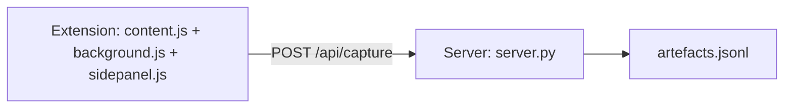

# Feed Analyser (X Capture Instrument)

> **Restructured.** This repo has pivoted from the original feed-analyser application to the **X capture instrument**. The legacy application lives under `archive/` (preserved on the `legacy` git branch); the current `capture/` directory holds the extension + server.

The capture instrument is a minimal tool for saving X/Twitter posts as you
browse, together with curated comments and your own notes. It is a plain-
JavaScript Chrome MV3 extension (no build step) plus a single-endpoint local
FastAPI server that stores each capture as one JSON line in `artefacts.jsonl`.

**The capture pipeline ends at the JSONL file** — analysis of the captured
content is deliberately left to separate, later tools.

## Full Documentation

The capture instrument is documented in full inside the repo itself at
`feed_analyser/openwiki/` — start at
[Capture Instrument Quickstart](/feed_analyser/openwiki/quickstart.md), then:

- [Extension](/feed_analyser/openwiki/capture/extension.md) — DOM scraping, Capture pill, capture state machine, link resolution, side panel
- [Server](/feed_analyser/openwiki/capture/server.md) — recursive validation, `captured_at` stamping, JSONL append
- [Architecture](/feed_analyser/openwiki/architecture/overview.md) — end-to-end flow and invariants
- [Archive](/feed_analyser/openwiki/archive/feed-analyser.md) — the superseded feed_analyser application

## Layout

```
capture/
├── extension/   # Chrome MV3 extension (unpacked, Brave/Chromium)
│   ├── manifest.json
│   ├── content.js     # Capture pill, recursive node scraper, open-capture state
│   ├── sidepanel.html / sidepanel.js  # live tree view + notes + Save
│   └── background.js  # service worker keeping capture state across navigation
└── server/      # local FastAPI server (dumb receiver)
    ├── server.py          # POST /api/capture → recursive validate → append → 200
    ├── artefacts.jsonl    # data (gitignored)
    └── tests/test_capture.py
```

## Flow



The user on an X detail page hovers a tweet → clicks the **Capture** pill →
`content.js` scrapes the root node and the side panel opens. Comments below
show the same pill; clicking adds/removes them (nested by DOM parent), forming
a live indented tree. On **Save**, `sidepanel.js` POSTs the recursive tree to
the server, which validates recursively, stamps `captured_at` on the root, appends
a line to `artefacts.jsonl`, and returns 200.

## Getting Started

```bash
cd capture/server
./capture/run-server.sh   # handles venv + deps, runs uvicorn on :8765
```

Override with `CAPTURE_PORT` / `CAPTURE_DATA` env vars.

## Related Work

- The **extension-inline-agent** task (now **complete** — implemented via the factory
  implementer pipeline and merged) planned to add a pi agent to the extension with
  access to the captured content and URLs. See the [Software
  Factory](/openwiki/projects/software-factory.md) task tracking.
- Design decisions for the capture instrument live in the knowledge base under
  the `feed-analyser` project section (capture architecture, API contract,
  recursive node tree, plain-files + SQLite FTS5 read API, etc.).

## Legacy Feed Analyser (Archived)

The original feed-analyser ingestion/classification application is archived
and no longer developed. Its prior architecture is preserved in
`feed_analyser/openwiki/archive/feed-analyser.md` and on the `legacy` git
branch. See factory-context: the repo is now listed as "Capture instrument:
thin Chrome extension + minimal local server."

