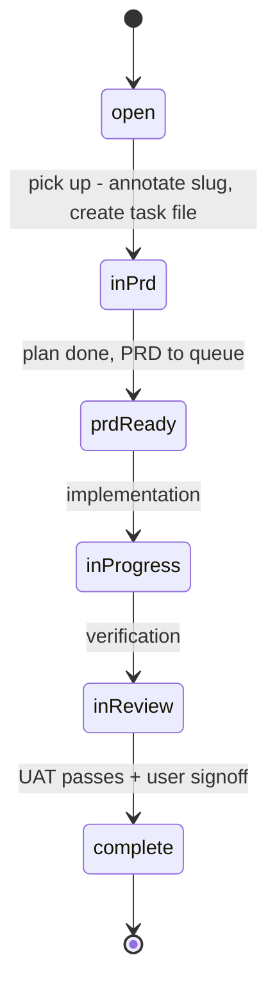

# Software Factory

The workspace is developed and maintained under a **software factory** paradigm
(`docs/factory-context.md` is the canonical source of truth, referenced from
[`AGENTS.md`](/AGENTS.md)). Four components share one rule: **the user only
interacts with the product/architecture layer — everything else is automation.**

## The Four Components

| Component | Role | Canonical location |
|-----------|------|--------------------|
| **context_engine** | Infrastructure spine; every other component reads/writes it. Progressive disclosure keeps agents lean — context loads on demand, never pre-loaded. The knowledge base (`docs/knowledge/`) is the last stop. | `docs/factory-context.md`, `docs/knowledge/` |
| **product/architecture** | The UX layer; the only surface the user interacts with. Produces one artifact per task: a plan document that accumulates Product Design / System Architecture / Program Design sections based on task size. Invoked via the `product-layer` skill. | [`/.agents/skills/product-layer/SKILL.md`](/openwiki/reference/agent-config.md) |
| **project_management** | Prioritisation + lifecycle tracking: task dashboard, task files (`docs/tasks/<slug>.md`), lifecycle state machine, and automated bookkeeping. | `docs/tasks.txt`, `docs/tasks/`, `bin/transition-task.sh` |
| **assembly_line** | CI/CD, agents, sandboxes, testing. Built YAGNI — the least-developed component until the agent pipeline. Now staffed by three sub-agents: **prd-reviewer** (PRD gating), **implementer** (build → PR), and **code-reviewer** (post-implementation review), orchestrated headless by the GitHub Actions workflow **`factory.yml`** (decision 03/04: a Final PRD in `docs/prd-queue/` runs the full loop on a GitHub-hosted runner). | `bin/implementer-run.sh`, `bin/review-run.sh`, `bin/factory-run.sh`, `bin/sanitize-session.sh`, `.github/workflows/factory.yml`, `.pi/agents/`, `config/implementer.json`, `config/reviewer.json` |

These components connect: the **product/architecture** layer is invoked through
the `product-layer` skill, which drives the **project_management** lifecycle
through the transition tooling (see [Agent Configuration](/openwiki/reference/agent-config.md)),
and captures design decisions into the **context_engine** knowledge base as a
byproduct.

## Task Lifecycle State Machine

Tasks progress through a lifecycle managed by task files and automated tooling.
The canonical state machine (decision
`Task Lifecycle State Machine and Transition Tooling`) is:

```
open → in-prd → prd-ready → in-progress → in-review → complete
```

| State | Meaning |
|-------|---------|
| `open` | In `tasks.txt`, not yet picked up (no `[slug]` annotation, no task file) |
| `in-prd` | Being planned; plan document being drafted |
| `prd-ready` | Plan done; task moves to Queued in `tasks.txt`, PRD enters `docs/prd-queue/` |
| `in-progress` | Being implemented (stays queued) |
| `in-review` | Being verified (stays queued) |
| `complete` | Done; task moves to Complete, PRD archived |



Note: the detailed `docs/tasks/README.md` names the two states
`in-implementation`/`in-verification`, while `bin/transition-task.sh` uses
`in-progress`/`in-review`. The convention that both share is
`transition-task.sh <slug> --to <state>` with states
`in-prd`, `prd-ready`, `in-progress`, `in-review`, `complete`.

### Lifecycle bookkeeping (`bin/transition-task.sh`)

`bin/transition-task.sh` is the single point of lifecycle bookkeeping and is
called by the `product-layer` skill. It:

1. Updates `docs/tasks/<slug>.md` (status, sessions, decisions, completion date) with clickable relative links;
2. Moves the task line in `docs/tasks.txt` to the correct status section;
3. Archives the PRD from `docs/prd-queue/` to `docs/prd-archive/` when the task reaches `complete`;
4. Commits everything.

Since the **merge-bundle** convention (task-pickup similarity check, decision
`Task similarity check scope and merge policy`), a task slug can annotate
**multiple** `docs/tasks.txt` lines — possibly across project sections. The
script now collects **all** lines containing `[<slug>]` and moves each into its
**own project's** target status section (`## all` lines stay under `## all`),
so a bundle closes every one of its lines on transition. The `Source` field of
a bundle task file lists each verbatim line.

It was hardened (decision
`Reliable Lifecycle Transition Script with Test Suite`) after three bugs: a
`set -euo pipefail` + `grep` crash on end-of-file sections, a `sed` replacement
injection that could corrupt task files containing `&` or `\`, and no way to test
or dry-run. The current version replaces `sed` with `python3` literal
replacement, uses `grep -Fq` fixed-string matching, validates session UUIDs,
checks for a git repo before committing, and supports `--dry-run`.

**Validation:** the standalone test suite `bin/test-transition-task.sh` runs
isolated temp workspaces (no git repo needed), including the regression case
(multiple decisions, section at end of file), edge cases (missing sections,
invalid state, dry-run, special characters), idempotency, and the
**multi-line bundle** case (each line lands under its own project's Complete,
none stranded in Pending). Run it any time you change the script.

## PRD Queue / Archive Gate

A PRD enters `docs/prd-queue/` when its task reaches `prd-ready`. It leaves the
queue (moves to `docs/prd-archive/`) **only when its task is genuinely done** —
meaning the feature passed **user acceptance testing AND the user explicitly
gave the go-ahead**. Code written + unit tests passing is NOT "complete." Until
UAT passes and the user signs off, keep the task at `prd-ready` and the PRD in
the queue. To reopen an archived PRD: move it back to `docs/prd-queue/`, set the
task to `prd-ready`, and re-point the Plan artifact path. (Decision
`PRD moves to archive only after UAT + user go-ahead`.)

The **PRD review sub-agent** (see [Agent Configuration](/openwiki/reference/agent-config.md))
acts as an in-session gate: before a plan is considered implementation-ready, it
runs deterministic (mechanical) and non-deterministic (judgment) checks and
returns a blocking/advisory report. PRDs that pass the gate move to **Final**
status. (Decisions `Review Sub-Agent as In-Session PRD Verification Gate`,
`PRD status lifecycle — Final when the review gate passes`.)

> **Final + `prd-ready` is the headless trigger.** Pushing a PRD to
> `docs/prd-queue/` with `**Status**: Final` while its task file says
<!-- openwiki: broken internal link [#headless-ci-github-actions] heading anchor "headless-ci-github-actions" does not exist in /openwiki/projects/software-factory.md. Fix the href or restore the target, then delete this comment. -->
> `**Status**: prd-ready` now fires the [headless CI loop](#headless-ci-github-actions)
> on GitHub. The status gate in `factory.yml` resolves the changed slug and
> silently exits when nothing is ready, so an early push to the queue does not
> half-run.

## Temporal Metadata Convention

Every factory artifact carries a timestamp with **minute precision** so agents
can reconstruct chronological order with a single `rg` call — no sequence
numbers, no coordination. Decision files carry `**Date**:` with
`yyyy-mm-dd HH:MM`; task files carry `**Created**:`. Within the knowledge base
index, entries are sorted oldest → newest within each project section so a scan
down reads as an evolution timeline.

Tooling: `bin/backfill-timestamps.sh` and `bin/sort-knowledge-index.py`
maintain the convention deterministically.

```bash
# All decisions + tasks sorted together (full factory timeline)
rg "^\*\*(Date|Created)\*\*" docs/knowledge/sessions/*/decisions/*.md docs/tasks/*.md | sort
```

## Task-Centric Storage & Traceability

Each task gets a file `docs/tasks/<slug>.md` — a reference hub linking to its
plan document, sessions, and decisions. The slug is appended to the task's line
in `docs/tasks.txt` so the mapping is explicit and deterministic. Traceability
connects a task from `tasks.txt` through the PRD queue to implementation and
verification sessions, capturing the entire lifecycle. (Decisions
`Task-Centric Storage`, `Traceability Links via Task Field`.)

### PR Tracking (Decision 06)

Task files carry a `## PRs` section that records PR ↔ review ↔ merge rows for
retrospective evaluation. Convention:

```
## PRs
| # | State | Relation | PR link | Session | Date |
|---|---|---|---|---|---|
| 1 | raised by implementer | factory/code-review-agent/... | #1 | <session-uuid> | 2026-08-14 |
| 2 | reviewed | verdict: APPROVE | #1 | <review-session-uuid> | 2026-08-15 |
```

Tooling: `bin/lib-pr-tracking.sh` (shared PR-tracking functions),
`bin/backfill-pr-tracking.sh` (backfill rows for pre-tracking tasks).

## Assembly Line Pipeline

The assembly line now consists of three sub-agents and supporting orchestration
tools that together form a full implement → review → merge cycle.

### Implementer Agent

A decoupled brain/hands pipeline: a **host driver** (`bin/implementer-run.sh`)
owns all git operations, while a **disposable `pi` worker** in a sandbox
container implements a `Final` PRD against a host-side worktree. The host
authors the single commit, pushes, and raises the PR. The user only
inspects/accepts the PR.

Key features:
- **`--pick`** selects the oldest `prd-ready` task with a `Final` PRD (decision 09)
- **`--revise <pr>`** resumes the original implementation session to address
  reviewer feedback, injecting the review report as binding authority (decision 08)
- **`--continue`** uses pi's native session continuation across container respawns
- **Ponytail skills** bind-mounted read-only at the fixed container path `/skills`
  from the host checkout (`config/implementer.json` → `ponytail.host_skills_dir`,
  default `$WORKSPACE/opensource/ponytail/skills`); if the host checkout is
  missing, the driver warns loudly and runs without the ponytail flags rather
  than failing or fabricating discipline (decision 04 — complete)
- **LLM credential fallback from `~/.pi/agent/auth.json`**: `write_env_file()`
  resolves `OPENROUTER_API_KEY` / `ANTHROPIC_API_KEY` for allowlist entries left
  unset by the host env — scoped strictly to the allowlist so the
  `github-copilot` token and nvidia key never enter the container; values go
  straight to the chmod-600 envfile, never echoed (decision
  `LLM credential resolution from pi's auth.json`). Model resolution likewise
  falls back to `PI_PROVIDER/PI_MODEL` when neither `IMPLEMENTER_MODEL` nor the
  config model is set.
- **Disposable-vs-durable enforcement**: container + raw logs are removed on
  successful delivery; only the commit/PR, archived report, and compact session
  evidence persist (decision 04 cleanup)
- **Delivery must be loud** (decision 08): a failed branch push or `gh pr create`
  returns non-zero and routes to `fail_run` (task reverted to `prd-ready`,
  partial report archived, exit 1) — never a false `Done (exit 0)`. `gh pr
  create` retries with 1s/2s backoff against transient GitHub 503s, and
  `pr_url=''` is initialized under `set -u` so the retry loop cannot crash
  unbound. The driver never prints "Pushed branch" / "PR raised" unless the
  operation actually landed
- Raises PR with label `factory:needs-review`

**Artefact map (full):** [`docs/reference/implementer-agent.md`](/docs/reference/implementer-agent.md)

<!-- openwiki: mermaid parse failed and this diagram was converted to a text fence so it does not break rendering. Fix the diagram source and restore the mermaid fence. Parser error: Heuristic: an unescaped angle bracket inside a label breaks rendering; rephrase the label. -->
```text
flowchart LR
    A["bin/implementer-run.sh<br/>(host driver)"] -->|spawns| B["pi worker<br/>(sandbox container)"]
    B -->|writes to| C["worktree + outbox/"]
    A -->|commits and pushes| D["GitHub PR"]
    A -->|archives| E["docs/implementations/date-slug/"]
```
Implementer: host driver → sandbox worker → worktree → PR.

### Code-Reviewer Agent

The post-implementation gate on the assembly line. Structurally identical to the
implementer: a **host driver** (`bin/review-run.sh`) owns all git mutations and
`gh` calls, while a **disposable read-only `pi` worker** in the sandbox checks a
raised PR against its PRD — running the PRD's own verification commands plus
deterministic and judgment checks (including the ponytail over-engineering pass).
It posts a structured APPROVE / REQUEST_CHANGES report to the PR.

**Core rule**: the reviewer is **read-only** — may run read-only git
(`diff/log/show/status`) but must never mutate git state, run `gh`, or hold any
GitHub credential. All mutations + PR comments are driver-side. The six ponytail
skills are bind-mounted read-only at `/skills` (same fixed-mount seam as the
implementer, `config/reviewer.json`).

**Lifecycle coupling (verdict → transition)**: the driver reads the verdict from
the archived report — matching the token at line start, **bare or
markdown-bold** (`**APPROVE**` / `**REQUEST_CHANGES**`; the earlier bare-token
anchor misread bold reports as reviewed-ok). `APPROVE` transitions the task
`in-progress → in-review`; **`REQUEST_CHANGES` leaves the task `in-progress`**
so the headless loop (or an operator) can revise and re-review — no premature
`in-review`.

**Invocation**:
```
bin/review-run.sh [<pr>|--pick] [--dry-run]
# <pr>      repo#num, owner/repo#num, or full pull-request URL
# --pick    oldest open PR labeled factory:needs-review
# --dry-run no gh mutations (comment/label), no transitions, no workspace-root commit
```

**Artefact map (full):** [`docs/reference/reviewer-agent.md`](/docs/reference/reviewer-agent.md)

<!-- openwiki: mermaid parse failed and this diagram was converted to a text fence so it does not break rendering. Fix the diagram source and restore the mermaid fence. Parser error: Heuristic: an unescaped angle bracket inside a label breaks rendering; rephrase the label. -->
```text
flowchart LR
    A["bin/review-run.sh<br/>(host driver)"] -->|spawns| B["pi worker<br/>(sandbox, read-only)"]
    B -->|reviews| C["PR head worktree"]
    B -->|writes| D["outbox/ (report + decisions)"]
    A -->|posts to PR| E["GitHub PR comment"]
    A -->|labels + transitions| F["task in-progress or in-review"]
    A -->|archives| G["docs/code-reviews/date-slug/"]
```
Reviewer: host driver → read-only worker → verdict report → driver-side PR comment + transition.

### factory-run.sh Orchestrator

A thin convenience wrapper (`bin/factory-run.sh`) that chains implementer →
review back-to-back. It runs the implementer first, then prompts the user for
UAT before running the review (interactive mode):

```
bin/factory-run.sh [--task <slug>] [--yes] [--implement-only] [--review <pr>] [--dry-run] [--headless]
```

**`--headless` (decision 04)** — fully autonomous loop with **no UAT gate**:
after the implementer raises the PR, it runs the review, reads the verdict back
from the archived report (`docs/code-reviews/<date>-<slug>/report.md`), and:

- **APPROVE** → stops; task is `in-review`, PR is merge-ready (decision 02)
- **REQUEST_CHANGES** → runs `implementer-run.sh --revise <pr>`, then re-reviews,
  up to `REVISION_CAP` (env-configurable, default 3)
- **cap exhausted / missing report / empty verdict** → surfaces the last report
  and exits non-zero (never falls through as success); an unrecognised verdict
  is surfaced but **not** revised

The PR to review is resolved from the **implementer's run log** first (it just
created the PR — the task file's decision-06 row may hold a stale URL from a
previous run's sync; reviewing the wrong PR silently was a real incident), then
the task-file row, then `--pick`.

**Authority-split guarantees** (decisions 01/05/07):
- This script **never merges**. After the chain, the human does UAT and runs
  `bin/merge-pr.sh` themselves.
- A UAT banner + prompt sits between implement and review (unless `--yes` or `--headless`).
- Master is never pushed by this chain — tracking commits accumulate locally
  and go up with the merge (locally) or the CI sync step (headless).

Exit codes: 0 (success / deferred / headless loop ended at APPROVE), 1 (implementer
failed or revision capped), 2 (reviewer failed), 3 (usage error).

### merge-pr.sh Operator Tool

`bin/merge-pr.sh` is the **only** path that pushes to master. It is a human-gated
operator step:

- Runs on the checked-out branch — operator must be on master (decision 11)
- Does not run inside any agent container
- The reviewer has no merge path (enforced in code + container; decision 07)

**Validation:** `bin/test-merge-pr.sh` (8 tests, fixture-based).

### Headless CI — GitHub Actions (`factory.yml`)

The root-level workflow [`.github/workflows/factory.yml`](/openwiki/operations/infrastructure.md)
turns a **Final + `prd-ready`** PRD push into a fully autonomous implement →
review → revise loop on a GitHub-hosted runner (decisions 03/04/05). Key
behavior:

<!-- openwiki: mermaid parse failed and this diagram was converted to a text fence so it does not break rendering. Fix the diagram source and restore the mermaid fence. Parser error: Heuristic: an unescaped angle bracket inside a label breaks rendering; rephrase the label. -->
```text
flowchart LR
    A["PRD push to docs/prd-queue/"] --> B["factory.yml status gate<br/>(Final + prd-ready)"]
    B -->|not ready| Z["silent exit 0"]
    B -->|ready| C["build sandbox:latest + clone repo_map targets"]
    C --> D["bin/factory-run.sh --headless<br/>(implementer → review → revise ≤3)"]
    D --> E["push trace bundle to ak47-arch/factory-traces<br/>(private eval retention)"]
    D --> F["sync tracking commits to master<br/>(docs only, conflict-tolerant)"]
    E --> F
```
Headless factory loop: PRD push → status gate → autonomous loop → trace retention + tracking sync.

- **Status gate + task resolution**: resolves the changed PRD's slug for
  `--task` (or `--pick` on ambiguity), verifies `Final` + `prd-ready`; exits
  silently when nothing is ready so an archive push re-firing the trigger is a
  **ghost run** no-op (the trace-bundle step also no-ops when neither run dir
  nor driver log exists).
- **Runner seams**: both container legs use `IMPLEMENTER_PODMAN_BIN=docker` /
  `REVIEWER_PODMAN_BIN=docker` — podman cannot start containers on
  GitHub-hosted runners (instant exit 125). `GH_TOKEN` (classic PAT) drives
  `gh`; git authenticates via a `url...insteadOf` rewrite, deliberately
  avoiding `gh auth login` (which demands `read:org` a classic PAT lacks).
  repo_map targets are shallow-cloned with local-dir → remote-name mapping
  (`llm → llamacpp_inference_server`, `survival-infrastructure → goal-agent`).
- **Sanitization seam (`bin/sanitize-session.sh`)**: both drivers finalize the
  in-repo session copy through it — redacting `sk-or-v1-*`, `sk-lf-*`, `gho_*`,
  `ghp_*`, `github_pat_*`, `xox*-*`, `AKIA*` values in place so GitHub Push
  Protection (GH013) never blocks the tracking commit. **Raw** sessions and
  container logs go only to the **private** `ak47-arch/factory-traces` bundle —
  never to the public workspace repo (raw traces contain live credentials).
- **Tracking sync (`if: always()`)**: the final step `git add -A` →
  commit-if-dirty → `git pull -X theirs origin master` (conflict-tolerant, so a
  concurrent operator push is never clobbered and a rebase conflict cannot
  strand the sync) → `git push origin master`. Pusher of **docs/evidence only**;
  code only reaches master via a human-merged PR — see the master‑gate decision
  below. **Known hardening pending**: the step still uses `git add -A` (decision
  09 wants it narrowed to `git add docs/` plus a non-merge code-path tripwire).
- **Master commit hygiene (decision 09)**: a history audit found legacy driver
  delivery sweeps (commit worktree → master, including `bdac29e` pushing the
  exact files PR #10 later merged) — the legacy path is dead; `push_and_pr`
  only pushes the PR branch, and tests cover the failure paths.
- **Retention**: per-run `manifest.json` (run_id, event, repo, sha, task, PR,
  session UUIDs) is committed to `factory-traces` for eval retrospectives,
  along with the driver trace, streamed session, container logs, brief, and
  outbox reports.

## Agent Workforce Roster

The factory maintains a declarative roster in `docs/factory-context.md` so the
full workforce is discoverable in one hop:

| Agent | SDLC stage | Role | Definition |
|---|---|---|---|
| **prd-reviewer** | PRD gating (before implementation) | Read-only readiness verifier — gates a plan doc with deterministic + judgment checks, returns blocking/advisory report | `.pi/agents/prd-reviewer.md` |
| **implementer** | Implementation (build → PR) | Headless worker — implements a Final PRD in sandbox worktree, writes report + decisions; host raises the PR | `.pi/agents/implementer.md` · `bin/implementer-run.sh` |
| **code-reviewer** | Post-implementation review (PR → report) | Read-only worker — checks a raised PR against its PRD, posts APPROVE/REQUEST_CHANGES report to the PR | `.pi/agents/code-reviewer.md` · `bin/review-run.sh` |

## Source Files

| Path | Purpose |
|------|---------|
| `/docs/factory-context.md` | Canonical factory model + project inventory |
| `/docs/tasks.txt` | Flat task list (per-project, status-grouped, `[slug]` tags) |
| `/docs/tasks/` | One reference-hub file per task |
| `/docs/tasks/README.md` | Task traceability + lifecycle doc |
| `/bin/transition-task.sh` | Lifecycle bookkeeping script |
| `/bin/test-transition-task.sh` | Test suite for the transition script |
| `/bin/implementer-run.sh` | Host driver for the sandboxed implementer agent (pick → worktree → container → report → PR) |
| `/bin/sandbox-build.sh` | Builds the implementer sandbox container image |
| `/bin/test-implementer-driver.sh` | Fixture-based unit tests for the implementer driver |
| `/config/implementer.json` | Implementer driver config (repo map, model, timeouts, env allowlist) |
| `/.pi/agents/implementer.md` | The implementer sub-agent definition (ponytail + factory-worker rules) |
| `/.agents/skills/implementer-ops/` | The implementer run-contract skill |
| `/.agents/skills/implementer-save/` | Scoped decision capture for the implementer (driver-owned index) |
| `/bin/review-run.sh` | Host driver for the code-reviewer agent (resolve PR → read-only review → post verdict) |
| `/bin/test-review-driver.sh` | Fixture-based unit tests for the review driver |
| `/config/reviewer.json` | Review driver config (model, timeouts, repo_map, ponytail) |
| `/.pi/agents/code-reviewer.md` | The code-reviewer sub-agent definition (read-only, ponytail review pass) |
| `/.agents/skills/review-ops/` | The review run-contract skill (checks + report schema + ponytail pass) |
| `/bin/factory-run.sh` | Thin implement → review orchestrator (UAT gate; `--headless` loop to APPROVE; never merges) |
| `/bin/test-factory-run.sh` | Test suite for the factory-run orchestrator (incl. headless loop: APPROVE / revise / cap / empty-verdict) |
| `/bin/merge-pr.sh` | Operator-only merge tool (sole master-pusher) |
| `/bin/test-merge-pr.sh` | Test suite for the merge tool |
| `/bin/sanitize-session.sh` | Redacts live credentials (`sk-or-v1-*`, `sk-lf-*`, `gho_*`, `ghp_*`, `github_pat_*`, `xox*-*`, `AKIA*`) from session copies before they are committed (GH013 guard); run via `--dry-run` to preview |
| `/bin/lib-pr-tracking.sh` | Shared PR-tracking functions (raise/review/merge rows) |
| `/bin/backfill-pr-tracking.sh` | Backfills PR-tracking rows for earlier tasks |
| `/bin/eval-pipeline.py` | First pipeline evaluation pass (joins tasks/PR-tracking/implementations/reviews/sessions) |
| `/docs/reference/implementer-agent.md` | Implementer artefact map (one-hop resolution) |
| `/docs/reference/reviewer-agent.md` | Reviewer artefact map (one-hop resolution) |
| `/bin/backfill-timestamps.sh`, `/bin/sort-knowledge-index.py` | Temporal metadata tooling |
| `/docs/prd-queue/`, `/docs/prd-archive/` | Active / archived plan documents — a **Final** PRD in the queue with a `prd-ready` task triggers the headless loop |
| `/docs/knowledge/` | Curated design decisions + session traces (sanitized copies) |
| `/.agents/skills/product-layer/SKILL.md` | The UX-layer skill that drives the workflow (task similarity check + merge bundles) |
| `/.pi/extensions/subagent/` | Pi subagent extension (assembly-line infra) |
| `/.pi/agents/prd-reviewer.md` | PRD review sub-agent definition |
| `/.github/workflows/factory.yml` | Headless factory loop on GitHub Actions (status gate, container seams, trace bundle, tracking sync) |
| `/workspace-portability/container/` | Sandbox image build (`Dockerfile`, `run-sandbox.sh`, `sandbox-entrypoint.sh`) — `run-sandbox.sh` shares the auth.json credential fallback |

## Change Guidance

- **Adding or changing the factory model** → edit `docs/factory-context.md`, then
  update the four-component table and progressive-disclosure chain in this page
  and the pointer in `AGENTS.md`. Validate by re-reading the progressive-disclosure
  chain (it is the contract for how agents discover context).
- **Changing task lifecycle behavior** (states, transitions, PRD archiving, merge
  bundles) → the implementation seam is `bin/transition-task.sh`; the acceptance
  surface is `bin/test-transition-task.sh` (isolated temp workspaces, no git
  needed — run with `-v` for verbose), now including the **multi-line bundle**
  case (all `[slug]` lines move to their own project's target section). Update
  the state table and, if the state set changes, keep `docs/tasks/README.md`,
  the script header, and any knowledge decisions in agreement. Do not hand-edit
  `docs/tasks.txt` section placement manually for smooth transitions; prefer the
  script's `--to` so task files and tasks.txt stay consistent.
- **Adding a plan/PRD for a new task** → follow the `product-layer` skill: pick a
  task, **run the task-similarity check** across `docs/tasks.txt` (near-duplicate /
  same-subject / cross-project candidates; user-confirmed degree: full → merge
  bundle, partial → split with remainder registered as a new Pending line, none →
  single), derive a slug, categorise Small/Medium/Large (bundle = max of
  constituents), create `docs/tasks/<slug>.md` at `in-prd`, grill, capture
  decisions via `save-knowledge`, then transition to `prd-ready` (PRD enters
  `docs/prd-queue/`). A PRD is only "Final" after the review gate passes — and
  **Final + `prd-ready` fires the headless CI loop**, so only push that
  combination when you want a run.
- **Extending the review gate or adding a sub-agent** → the pi subagent extension
  is symlinked at `/.pi/extensions/subagent/` (from `opensource/pi-mono/...`)
  and agent definitions live at `/.pi/agents/<name>.md` with `model`, `tools`,
  `agentScope`. Enforce read-only at the tool list, not just the prompt. After
  changing, verify live in an interactive pi session (`/reload`, then invoke the
  agent). A change here is a **shipped-surface** change — confirm the agent
  resolves from the project-local scope consumers use, not just that the file
  typechecks.
- **Changing the implementer driver** → the seam is `bin/implementer-run.sh`; the
  acceptance surface is `bin/test-implementer-driver.sh` (fixture-based; includes
  mock gh that rejects unknown `--json` fields to stay host-gh compatible —
  decision 10, plus delivery-failure fixtures asserting exit 1, task revert, and
  no false-success output). Run it any time the driver, config, or PR/gh calls
  change. Note the real-host discovery bug class: mock-gh/sourced-main
  simulations hid 3 real driver defects (decision 02 review-simulation-blind-spot),
  so also dogfood on a real PR when a new gh call is introduced.
- **Changing the reviewer driver** → the seam is `bin/review-run.sh` +
  `config/reviewer.json`; the acceptance surface is `bin/test-review-driver.sh`.
  The reviewer must stay read-only: never add a merge/complete path or a GitHub
  credential to the container. If you change verdict semantics, update both the
  driver and `factory-run.sh`'s `read_verdict` (they must parse the same token).
- **Adding a factory orchestration step or headless-loop behavior** → prefer
  `bin/factory-run.sh` (keeps the never-merges and master-not-pushed invariants)
  rather than inline chains in other scripts; validate with
  `bin/test-factory-run.sh` (headless coverage: APPROVE stops the loop,
  REQUEST_CHANGES → revise → APPROVE, `REVISION_CAP=0` blocks revise, cap
  exhaustion exits 1 and surfaces the report, empty/missing verdict → surface
  without revise).
- **Changing the CI headless wiring** → the seam is `.github/workflows/factory.yml`;
  validate a *behavioral* slice with the drivers' test suites, then dogfood a
  real Final-prd-ready push (the runner-only paths — podman→docker seams, PAT
  insteadOf auth, trace bundle, tracking sync — have no local test). Re-check
  the **ghost-run guard** and the `git add -A` sync step (hardening to
  `git add docs/` + a code-path tripwire is pending, decision 09).
- **Changing session-save / evidence capture** → the seam is
  `bin/sanitize-session.sh` (add patterns there, never in drivers) plus the
  `save-knowledge` skill; verify with `bash bin/sanitize-session.sh --dry-run
  <file>` before committing copies. Never put raw sessions (live credentials)
  on the public master — the private `factory-traces` bundle owns those.
- **Reviewing/merging a PR** → the operator tool `bin/merge-pr.sh` is the only
  master-pusher; it must run on master (decision 11). Validate with
  `bin/test-merge-pr.sh`. If the implementer driver died before the host
  delivery, complete delivery manually per decision 12
  (manual-host-delivery-fallback).
- **Revising an implementation for a historical/cross-repo PR** → `--revise` needs a
  36-char impl-session UUID on the task's `Raised by` row (decision 13); add or
  backfill it before use.

## Backlog / Known Open Items

- The full headless loop has now run live: `headless-agent-containerisation`
  (PR #6, `ponytail-skills-fixed-mount`, `sandbox-credential-mounting`,
  `task-pickup-similarity-merge`) and `implementer-delivery-failure-loud`
  (PRs #10/#11, merged 2026-08-18) were driven end-to-end on GitHub Actions
  with the revise loop and the tracking sync. The first cloud task also exposed
  the **direct-code-sweep incident** (`bdac29e`) that produced decision 09.
- Open items: narrowing the CI tracking sync from `git add -A` to `git add
  docs/` + a non-merge code-path tripwire (decision 09); any headless PRD
  review still runs through the subagent (requires a live pi session for the
  `agentScope` prompt — a headless path for the *PRD* gate itself remains an
  open question); knowledge base growth beyond ~50 entries may warrant vector
  search (`opensource/cognee`) per `KNOWN_ISSUES.md` issue 7.
