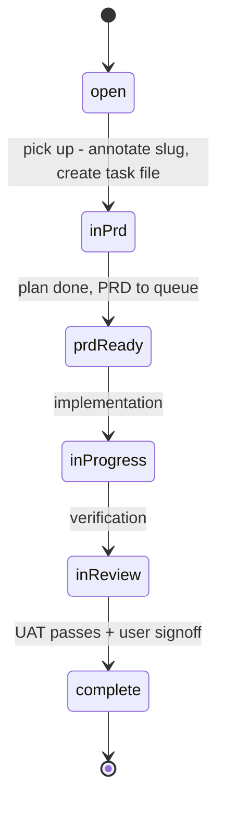

# Software Factory

The workspace is developed and maintained under a **software factory** paradigm
(`docs/factory-context.md` is the canonical source of truth, referenced from
[`AGENTS.md`](/AGENTS.md)). Four components share one rule: **the user only
interacts with the product/architecture layer — everything else is automation.**

## The Four Components

| Component | Role | Canonical location |
|-----------|------|--------------------|
| **context_engine** | Infrastructure spine; every other component reads/writes it. Progressive disclosure keeps agents lean — context loads on demand, never pre-loaded. The knowledge base (`docs/knowledge/`) is the last stop. | `docs/factory-context.md`, `docs/knowledge/` |
| **product/architecture** | The UX layer; the only surface the user interacts with. Produces one artifact per task: a plan document that accumulates Product Design / System Architecture / Program Design sections based on task size. Invoked via the `product-layer` skill. | [`/.agents/skills/product-layer/SKILL.md`](/openwiki/reference/agent-config.md) |
| **project_management** | Prioritisation + lifecycle tracking: task dashboard, task files (`docs/tasks/<slug>.md`), lifecycle state machine, and automated bookkeeping. | `docs/tasks.txt`, `docs/tasks/`, `bin/transition-task.sh` |
| **assembly_line** | CI/CD, agents, sandboxes, testing. Built YAGNI — the least-developed component. | subagent extension (`/.pi/extensions/subagent/`), `.pi/agents/prd-reviewer.md` |

These components connect: the **product/architecture** layer is invoked through
the `product-layer` skill, which drives the **project_management** lifecycle
through the transition tooling (see [Agent Configuration](/openwiki/reference/agent-config.md)),
and captures design decisions into the **context_engine** knowledge base as a
byproduct.

## Task Lifecycle State Machine

Tasks progress through a lifecycle managed by task files and automated tooling.
The canonical state machine (decision
`Task Lifecycle State Machine and Transition Tooling`) is:

```
open → in-prd → prd-ready → in-progress → in-review → complete
```

| State | Meaning |
|-------|---------|
| `open` | In `tasks.txt`, not yet picked up (no `[slug]` annotation, no task file) |
| `in-prd` | Being planned; plan document being drafted |
| `prd-ready` | Plan done; task moves to Queued in `tasks.txt`, PRD enters `docs/prd-queue/` |
| `in-progress` | Being implemented (stays queued) |
| `in-review` | Being verified (stays queued) |
| `complete` | Done; task moves to Complete, PRD archived |



Note: the detailed `docs/tasks/README.md` names the two states
`in-implementation`/`in-verification`, while `bin/transition-task.sh` uses
`in-progress`/`in-review`. The convention that both share is
`transition-task.sh <slug> --to <state>` with states
`in-prd`, `prd-ready`, `in-progress`, `in-review`, `complete`.

### Lifecycle bookkeeping (`bin/transition-task.sh`)

`bin/transition-task.sh` is the single point of lifecycle bookkeeping and is
called by the `product-layer` skill. It:

1. Updates `docs/tasks/<slug>.md` (status, sessions, decisions, completion date) with clickable relative links;
2. Moves the task line in `docs/tasks.txt` to the correct status section;
3. Archives the PRD from `docs/prd-queue/` to `docs/prd-archive/` when the task reaches `complete`;
4. Commits everything.

It was hardened (decision
`Reliable Lifecycle Transition Script with Test Suite`) after three bugs: a
`set -euo pipefail` + `grep` crash on end-of-file sections, a `sed` replacement
injection that could corrupt task files containing `&` or `\`, and no way to test
or dry-run. The current version replaces `sed` with `python3` literal
replacement, uses `grep -Fq` fixed-string matching, validates session UUIDs,
checks for a git repo before committing, and supports `--dry-run`.

**Validation:** the standalone test suite `bin/test-transition-task.sh` runs 13
tests / 45 assertions against isolated temp workspaces (no git repo needed),
including the regression case (multiple decisions, section at end of file),
edge cases (missing sections, invalid state, dry-run, special characters), and
idempotency. Run it any time you change the script.

## PRD Queue / Archive Gate

A PRD enters `docs/prd-queue/` when its task reaches `prd-ready`. It leaves the
queue (moves to `docs/prd-archive/`) **only when its task is genuinely done** —
meaning the feature passed **user acceptance testing AND the user explicitly
gave the go-ahead**. Code written + unit tests passing is NOT "complete." Until
UAT passes and the user signs off, keep the task at `prd-ready` and the PRD in
the queue. To reopen an archived PRD: move it back to `docs/prd-queue/`, set the
task to `prd-ready`, and re-point the Plan artifact path. (Decision
`PRD moves to archive only after UAT + user go-ahead`.)

The **PRD review sub-agent** (see [Agent Configuration](/openwiki/reference/agent-config.md))
acts as an in-session gate: before a plan is considered implementation-ready, it
runs deterministic (mechanical) and non-deterministic (judgment) checks and
returns a blocking/advisory report. PRDs that pass the gate move to **Final**
status. (Decisions `Review Sub-Agent as In-Session PRD Verification Gate`,
`PRD status lifecycle — Final when the review gate passes`.)

## Temporal Metadata Convention

Every factory artifact carries a timestamp with **minute precision** so agents
can reconstruct chronological order with a single `rg` call — no sequence
numbers, no coordination. Decision files carry `**Date**:` with
`yyyy-mm-dd HH:MM`; task files carry `**Created**:`. Within the knowledge base
index, entries are sorted oldest → newest within each project section so a scan
down reads as an evolution timeline.

Tooling: `bin/backfill-timestamps.sh` and `bin/sort-knowledge-index.py`
maintain the convention deterministically.

```bash
# All decisions + tasks sorted together (full factory timeline)
rg "^\*\*(Date|Created)\*\*" docs/knowledge/sessions/*/decisions/*.md docs/tasks/*.md | sort
```

## Task-Centric Storage & Traceability

Each task gets a file `docs/tasks/<slug>.md` — a reference hub linking to its
plan document, sessions, and decisions. The slug is appended to the task's line
in `docs/tasks.txt` so the mapping is explicit and deterministic. Traceability
connects a task from `tasks.txt` through the PRD queue to implementation and
verification sessions, capturing the entire lifecycle. (Decisions
`Task-Centric Storage`, `Traceability Links via Task Field`.)

## Source Files

| Path | Purpose |
|------|---------|
| `/docs/factory-context.md` | Canonical factory model + project inventory |
| `/docs/tasks.txt` | Flat task list (per-project, status-grouped, `[slug]` tags) |
| `/docs/tasks/` | One reference-hub file per task |
| `/docs/tasks/README.md` | Task traceability + lifecycle doc |
| `/bin/transition-task.sh` | Lifecycle bookkeeping script |
| `/bin/test-transition-task.sh` | Test suite for the transition script |
| `/bin/backfill-timestamps.sh`, `/bin/sort-knowledge-index.py` | Temporal metadata tooling |
| `/docs/prd-queue/`, `/docs/prd-archive/` | Active / archived plan documents |
| `/docs/knowledge/` | Curated design decisions + session traces |
| `/.agents/skills/product-layer/SKILL.md` | The UX-layer skill that drives the workflow |
| `/.pi/extensions/subagent/` | Pi subagent extension (assembly-line infra) |
| `/.pi/agents/prd-reviewer.md` | PRD review sub-agent definition |

## Change Guidance

- **Adding or changing the factory model** → edit `docs/factory-context.md`, then
  update the four-component table and progressive-disclosure chain in this page
  and the pointer in `AGENTS.md`. Validate by re-reading the progressive-disclosure
  chain (it is the contract for how agents discover context).
- **Changing task lifecycle behavior** (states, transitions, PRD archiving) →
  the implementation seam is `bin/transition-task.sh`; the acceptance surface is
  `bin/test-transition-task.sh` (`13` tests, `45` assertions, isolated temp
  workspaces, no git needed — run with `-v` for verbose). Update the state table
  and, if the state set changes, keep `docs/tasks/README.md`, the script header,
  and any knowledge decisions in agreement. Do not hand-edit `docs/tasks.txt`
  section placement manually for smooth transitions; prefer the script's `--to`
  so task files and tasks.txt stay consistent.
- **Adding a plan/PRD for a new task** → follow the `product-layer` skill: pick a
  task, derive a slug, categorise Small/Medium/Large, create `docs/tasks/<slug>.md`
  at `in-prd`, grill, capture decisions via `save-knowledge`, then transition to
  `prd-ready` (PRD enters `docs/prd-queue/`). A PRD is only "Final" after the
  review gate passes.
- **Extending the review gate or adding a sub-agent** → the pi subagent extension
  is symlinked at `/.pi/extensions/subagent/` (from `opensource/pi-mono/...`)
  and agent definitions live at `/.pi/agents/<name>.md` with `model`, `tools`,
  `agentScope`. Enforce read-only at the tool list, not just the prompt. After
  changing, verify live in an interactive pi session (`/reload`, then invoke the
  agent). A change here is a **shipped-surface** change — confirm the agent
  resolves from the project-local scope consumers use, not just that the file
  typechecks.
- **Deploying the review gate headlessly** → currently requires a user session
  (the `agentScope` confirmation prompt). A headless path is a known open question
  (revision trigger in decision 04).

## Backlog / Known Open Items

- The **implementer agent** ("Build the implementer agent") and extending the prod
  review agent are pending software-factory tasks in `docs/tasks.txt`.
- Headless (no user session) PRD review is not yet supported.
- Knowledge base growth beyond ~50 entries may warrant vector search
  (`opensource/cognee`) per `KNOWN_ISSUES.md` issue 7.
