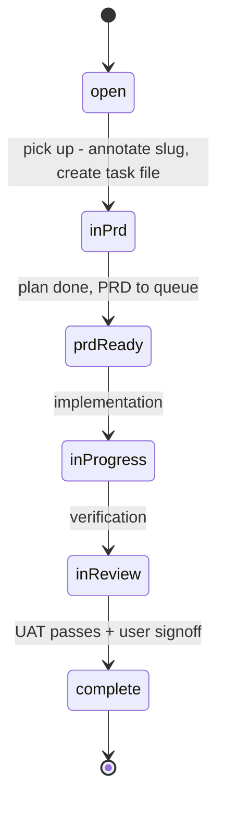

# Software Factory

The workspace is developed and maintained under a **software factory** paradigm
(`docs/factory-context.md` is the canonical source of truth, referenced from
[`AGENTS.md`](/AGENTS.md)). Four components share one rule: **the user only
interacts with the product/architecture layer — everything else is automation.**

## The Four Components

| Component | Role | Canonical location |
|-----------|------|--------------------|
| **context_engine** | Infrastructure spine; every other component reads/writes it. Progressive disclosure keeps agents lean — context loads on demand, never pre-loaded. The knowledge base (`docs/knowledge/`) is the last stop. | `docs/factory-context.md`, `docs/knowledge/` |
| **product/architecture** | The UX layer; the only surface the user interacts with. Produces one artifact per task: a plan document that accumulates Product Design / System Architecture / Program Design sections based on task size. Invoked via the `product-layer` skill. | [`/.agents/skills/product-layer/SKILL.md`](/openwiki/reference/agent-config.md) |
| **project_management** | Prioritisation + lifecycle tracking: task dashboard, task files (`docs/tasks/<slug>.md`), lifecycle state machine, and automated bookkeeping. | `docs/tasks.txt`, `docs/tasks/`, `bin/transition-task.sh` |
| **assembly_line** | CI/CD, agents, sandboxes, testing. Built YAGNI — the least-developed component until the agent pipeline. Now staffed by three sub-agents: **prd-reviewer** (PRD gating), **implementer** (build → PR), and **code-reviewer** (post-implementation review). | `bin/implementer-run.sh`, `bin/review-run.sh`, `bin/factory-run.sh`, `.pi/agents/`, `config/implementer.json`, `config/reviewer.json` |

These components connect: the **product/architecture** layer is invoked through
the `product-layer` skill, which drives the **project_management** lifecycle
through the transition tooling (see [Agent Configuration](/openwiki/reference/agent-config.md)),
and captures design decisions into the **context_engine** knowledge base as a
byproduct.

## Task Lifecycle State Machine

Tasks progress through a lifecycle managed by task files and automated tooling.
The canonical state machine (decision
`Task Lifecycle State Machine and Transition Tooling`) is:

```
open → in-prd → prd-ready → in-progress → in-review → complete
```

| State | Meaning |
|-------|---------|
| `open` | In `tasks.txt`, not yet picked up (no `[slug]` annotation, no task file) |
| `in-prd` | Being planned; plan document being drafted |
| `prd-ready` | Plan done; task moves to Queued in `tasks.txt`, PRD enters `docs/prd-queue/` |
| `in-progress` | Being implemented (stays queued) |
| `in-review` | Being verified (stays queued) |
| `complete` | Done; task moves to Complete, PRD archived |



Note: the detailed `docs/tasks/README.md` names the two states
`in-implementation`/`in-verification`, while `bin/transition-task.sh` uses
`in-progress`/`in-review`. The convention that both share is
`transition-task.sh <slug> --to <state>` with states
`in-prd`, `prd-ready`, `in-progress`, `in-review`, `complete`.

### Lifecycle bookkeeping (`bin/transition-task.sh`)

`bin/transition-task.sh` is the single point of lifecycle bookkeeping and is
called by the `product-layer` skill. It:

1. Updates `docs/tasks/<slug>.md` (status, sessions, decisions, completion date) with clickable relative links;
2. Moves the task line in `docs/tasks.txt` to the correct status section;
3. Archives the PRD from `docs/prd-queue/` to `docs/prd-archive/` when the task reaches `complete`;
4. Commits everything.

It was hardened (decision
`Reliable Lifecycle Transition Script with Test Suite`) after three bugs: a
`set -euo pipefail` + `grep` crash on end-of-file sections, a `sed` replacement
injection that could corrupt task files containing `&` or `\`, and no way to test
or dry-run. The current version replaces `sed` with `python3` literal
replacement, uses `grep -Fq` fixed-string matching, validates session UUIDs,
checks for a git repo before committing, and supports `--dry-run`.

**Validation:** the standalone test suite `bin/test-transition-task.sh` runs 13
tests / 45 assertions against isolated temp workspaces (no git repo needed),
including the regression case (multiple decisions, section at end of file),
edge cases (missing sections, invalid state, dry-run, special characters), and
idempotency. Run it any time you change the script.

## PRD Queue / Archive Gate

A PRD enters `docs/prd-queue/` when its task reaches `prd-ready`. It leaves the
queue (moves to `docs/prd-archive/`) **only when its task is genuinely done** —
meaning the feature passed **user acceptance testing AND the user explicitly
gave the go-ahead**. Code written + unit tests passing is NOT "complete." Until
UAT passes and the user signs off, keep the task at `prd-ready` and the PRD in
the queue. To reopen an archived PRD: move it back to `docs/prd-queue/`, set the
task to `prd-ready`, and re-point the Plan artifact path. (Decision
`PRD moves to archive only after UAT + user go-ahead`.)

The **PRD review sub-agent** (see [Agent Configuration](/openwiki/reference/agent-config.md))
acts as an in-session gate: before a plan is considered implementation-ready, it
runs deterministic (mechanical) and non-deterministic (judgment) checks and
returns a blocking/advisory report. PRDs that pass the gate move to **Final**
status. (Decisions `Review Sub-Agent as In-Session PRD Verification Gate`,
`PRD status lifecycle — Final when the review gate passes`.)

## Temporal Metadata Convention

Every factory artifact carries a timestamp with **minute precision** so agents
can reconstruct chronological order with a single `rg` call — no sequence
numbers, no coordination. Decision files carry `**Date**:` with
`yyyy-mm-dd HH:MM`; task files carry `**Created**:`. Within the knowledge base
index, entries are sorted oldest → newest within each project section so a scan
down reads as an evolution timeline.

Tooling: `bin/backfill-timestamps.sh` and `bin/sort-knowledge-index.py`
maintain the convention deterministically.

```bash
# All decisions + tasks sorted together (full factory timeline)
rg "^\*\*(Date|Created)\*\*" docs/knowledge/sessions/*/decisions/*.md docs/tasks/*.md | sort
```

## Task-Centric Storage & Traceability

Each task gets a file `docs/tasks/<slug>.md` — a reference hub linking to its
plan document, sessions, and decisions. The slug is appended to the task's line
in `docs/tasks.txt` so the mapping is explicit and deterministic. Traceability
connects a task from `tasks.txt` through the PRD queue to implementation and
verification sessions, capturing the entire lifecycle. (Decisions
`Task-Centric Storage`, `Traceability Links via Task Field`.)

### PR Tracking (Decision 06)

Task files carry a `## PRs` section that records PR ↔ review ↔ merge rows for
retrospective evaluation. Convention:

```
## PRs
| # | State | Relation | PR link | Session | Date |
|---|---|---|---|---|---|
| 1 | raised by implementer | factory/code-review-agent/... | #1 | <session-uuid> | 2026-08-14 |
| 2 | reviewed | verdict: APPROVE | #1 | <review-session-uuid> | 2026-08-15 |
```

Tooling: `bin/lib-pr-tracking.sh` (shared PR-tracking functions),
`bin/backfill-pr-tracking.sh` (backfill rows for pre-tracking tasks).

## Assembly Line Pipeline

The assembly line now consists of three sub-agents and supporting orchestration
tools that together form a full implement → review → merge cycle.

### Implementer Agent

A decoupled brain/hands pipeline: a **host driver** (`bin/implementer-run.sh`)
owns all git operations, while a **disposable `pi` worker** in a sandbox
container implements a `Final` PRD against a host-side worktree. The host
authors the single commit, pushes, and raises the PR. The user only
inspects/accepts the PR.

Key features:
- **`--pick`** selects the oldest `prd-ready` task with a `Final` PRD (decision 09)
- **`--revise <pr>`** resumes the original implementation session to address
  reviewer feedback, injecting the review report as binding authority (decision 08)
- **`--continue`** uses pi's native session continuation across container respawns
- **Ponytail skills** injected via `--skill` flags (decision 04 — complete)
- **Disposable-vs-durable enforcement**: container + raw logs are removed on
  successful delivery; only the commit/PR, archived report, and compact session
  evidence persist (decision 04 cleanup)
- Raises PR with label `factory:needs-review`

**Artefact map (full):** [`docs/reference/implementer-agent.md`](/docs/reference/implementer-agent.md)

<!-- openwiki: mermaid parse failed and this diagram was converted to a text fence so it does not break rendering. Fix the diagram source and restore the mermaid fence. Parser error: Heuristic: a semicolon inside a label breaks rendering; rephrase the label. -->
```text
flowchart LR
    A["bin/implementer-run.sh<br/>(host driver)"] -->|"spawns"| B["pi worker<br/>(sandbox container)"]
    B -->|"writes to"| C["worktree + outbox/"]
    A -->|"commits & pushes"| D["GitHub PR"]
    A -->|"archives"| E["docs/implementations/<br/>&lt;date&gt;-&lt;slug&gt;/"]
```

### Code-Reviewer Agent

The post-implementation gate on the assembly line. Structurally identical to the
implementer: a **host driver** (`bin/review-run.sh`) owns all git mutations and
`gh` calls, while a **disposable read-only `pi` worker** in the sandbox checks a
raised PR against its PRD — running the PRD's own verification commands plus
deterministic and judgment checks (including the ponytail over-engineering pass).
It posts a structured APPROVE / REQUEST_CHANGES report to the PR.

**Core rule**: the reviewer is **read-only** — may run read-only git
(`diff/log/show/status`) but must never mutate git state, run `gh`, or hold any
GitHub credential. All mutations + PR comments are driver-side. The six ponytail
skills are injected reviewer-scoped via `--skill` flags.

**Invocation**:
```
bin/review-run.sh [<pr>|--pick] [--dry-run]
# <pr>      repo#num, owner/repo#num, or full pull-request URL
# --pick    oldest open PR labeled factory:needs-review
# --dry-run no gh mutations (comment/label), no transitions, no workspace-root commit
```

**Artefact map (full):** [`docs/reference/reviewer-agent.md`](/docs/reference/reviewer-agent.md)

<!-- openwiki: mermaid parse failed and this diagram was converted to a text fence so it does not break rendering. Fix the diagram source and restore the mermaid fence. Parser error: Heuristic: a semicolon inside a label breaks rendering; rephrase the label. -->
```text
flowchart LR
    A["bin/review-run.sh<br/>(host driver)"] -->|"spawns"| B["pi worker<br/>(sandbox, read-only)"]
    B -->|"reviews"| C["PR head worktree"]
    B -->|"writes"| D["outbox/ (report + decisions)"]
    A -->|"posts to PR"| E["GitHub PR comment"]
    A -->|"labels + transitions"| F["task -> in-review"]
    A -->|"archives"| G["docs/code-reviews/<br/>&lt;date&gt;-&lt;slug&gt;/"]
```

### factory-run.sh Orchestrator

A thin convenience wrapper (`bin/factory-run.sh`) that chains implementer →
review back-to-back. It runs the implementer first, then prompts the user for
UAT before running the review:

```
bin/factory-run.sh [--task <slug>] [--yes] [--implement-only] [--review <pr>] [--dry-run]
```

**Authority-split guarantees** (decisions 01/05/07):
- This script **never merges**. After the chain, the human does UAT and runs
  `bin/merge-pr.sh` themselves.
- A UAT banner + prompt sits between implement and review (unless `--yes`).
- Master is never pushed by this chain — tracking commits accumulate locally
  and go up with the merge.

Exit codes: 0 (success), 1 (implementer failed), 2 (reviewer failed), 3 (usage error).

### merge-pr.sh Operator Tool

`bin/merge-pr.sh` is the **only** path that pushes to master. It is a human-gated
operator step:

- Runs on the checked-out branch — operator must be on master (decision 11)
- Does not run inside any agent container
- The reviewer has no merge path (enforced in code + container; decision 07)

**Validation:** `bin/test-merge-pr.sh` (8 tests, fixture-based).

## Agent Workforce Roster

The factory maintains a declarative roster in `docs/factory-context.md` so the
full workforce is discoverable in one hop:

| Agent | SDLC stage | Role | Definition |
|---|---|---|---|
| **prd-reviewer** | PRD gating (before implementation) | Read-only readiness verifier — gates a plan doc with deterministic + judgment checks, returns blocking/advisory report | `.pi/agents/prd-reviewer.md` |
| **implementer** | Implementation (build → PR) | Headless worker — implements a Final PRD in sandbox worktree, writes report + decisions; host raises the PR | `.pi/agents/implementer.md` · `bin/implementer-run.sh` |
| **code-reviewer** | Post-implementation review (PR → report) | Read-only worker — checks a raised PR against its PRD, posts APPROVE/REQUEST_CHANGES report to the PR | `.pi/agents/code-reviewer.md` · `bin/review-run.sh` |

## Source Files

| Path | Purpose |
|------|---------|
| `/docs/factory-context.md` | Canonical factory model + project inventory |
| `/docs/tasks.txt` | Flat task list (per-project, status-grouped, `[slug]` tags) |
| `/docs/tasks/` | One reference-hub file per task |
| `/docs/tasks/README.md` | Task traceability + lifecycle doc |
| `/bin/transition-task.sh` | Lifecycle bookkeeping script |
| `/bin/test-transition-task.sh` | Test suite for the transition script |
| `/bin/implementer-run.sh` | Host driver for the sandboxed implementer agent (pick → worktree → container → report → PR) |
| `/bin/sandbox-build.sh` | Builds the implementer sandbox container image |
| `/bin/test-implementer-driver.sh` | Fixture-based unit tests for the implementer driver |
| `/config/implementer.json` | Implementer driver config (repo map, model, timeouts, env allowlist) |
| `/.pi/agents/implementer.md` | The implementer sub-agent definition (ponytail + factory-worker rules) |
| `/.agents/skills/implementer-ops/` | The implementer run-contract skill |
| `/.agents/skills/implementer-save/` | Scoped decision capture for the implementer (driver-owned index) |
| `/bin/review-run.sh` | Host driver for the code-reviewer agent (resolve PR → read-only review → post verdict) |
| `/bin/test-review-driver.sh` | Fixture-based unit tests for the review driver |
| `/config/reviewer.json` | Review driver config (model, timeouts, repo_map, ponytail) |
| `/.pi/agents/code-reviewer.md` | The code-reviewer sub-agent definition (read-only, ponytail review pass) |
| `/.agents/skills/review-ops/` | The review run-contract skill (checks + report schema + ponytail pass) |
| `/bin/factory-run.sh` | Thin implement → review orchestrator (UAT gate; never merges) |
| `/bin/test-factory-run.sh` | Test suite for the factory-run orchestrator |
| `/bin/merge-pr.sh` | Operator-only merge tool (sole master-pusher) |
| `/bin/test-merge-pr.sh` | Test suite for the merge tool |
| `/bin/lib-pr-tracking.sh` | Shared PR-tracking functions (raise/review/merge rows) |
| `/bin/backfill-pr-tracking.sh` | Backfills PR-tracking rows for earlier tasks |
| `/bin/eval-pipeline.py` | First pipeline evaluation pass (joins tasks/PR-tracking/implementations/reviews/sessions) |
| `/docs/reference/implementer-agent.md` | Implementer artefact map (one-hop resolution) |
| `/docs/reference/reviewer-agent.md` | Reviewer artefact map (one-hop resolution) |
| `/bin/backfill-timestamps.sh`, `/bin/sort-knowledge-index.py` | Temporal metadata tooling |
| `/docs/prd-queue/`, `/docs/prd-archive/` | Active / archived plan documents |
| `/docs/knowledge/` | Curated design decisions + session traces |
| `/.agents/skills/product-layer/SKILL.md` | The UX-layer skill that drives the workflow |
| `/.pi/extensions/subagent/` | Pi subagent extension (assembly-line infra) |
| `/.pi/agents/prd-reviewer.md` | PRD review sub-agent definition |

## Change Guidance

- **Adding or changing the factory model** → edit `docs/factory-context.md`, then
  update the four-component table and progressive-disclosure chain in this page
  and the pointer in `AGENTS.md`. Validate by re-reading the progressive-disclosure
  chain (it is the contract for how agents discover context).
- **Changing task lifecycle behavior** (states, transitions, PRD archiving) →
  the implementation seam is `bin/transition-task.sh`; the acceptance surface is
  `bin/test-transition-task.sh` (`13` tests, `45` assertions, isolated temp
  workspaces, no git needed — run with `-v` for verbose). Update the state table
  and, if the state set changes, keep `docs/tasks/README.md`, the script header,
  and any knowledge decisions in agreement. Do not hand-edit `docs/tasks.txt`
  section placement manually for smooth transitions; prefer the script's `--to`
  so task files and tasks.txt stay consistent.
- **Adding a plan/PRD for a new task** → follow the `product-layer` skill: pick a
  task, derive a slug, categorise Small/Medium/Large, create `docs/tasks/<slug>.md`
  at `in-prd`, grill, capture decisions via `save-knowledge`, then transition to
  `prd-ready` (PRD enters `docs/prd-queue/`). A PRD is only "Final" after the
  review gate passes.
- **Extending the review gate or adding a sub-agent** → the pi subagent extension
  is symlinked at `/.pi/extensions/subagent/` (from `opensource/pi-mono/...`)
  and agent definitions live at `/.pi/agents/<name>.md` with `model`, `tools`,
  `agentScope`. Enforce read-only at the tool list, not just the prompt. After
  changing, verify live in an interactive pi session (`/reload`, then invoke the
  agent). A change here is a **shipped-surface** change — confirm the agent
  resolves from the project-local scope consumers use, not just that the file
  typechecks.
- **Deploying the review gate headlessly** → currently requires a user session
  (the `agentScope` confirmation prompt). A headless path is a known open question
  (revision trigger in decision 04).
- **Changing the implementer driver** → the seam is `bin/implementer-run.sh`; the
  acceptance surface is `bin/test-implementer-driver.sh` (fixture-based; includes
  mock gh that rejects unknown `--json` fields to stay host-gh compatible — decision
  10). Run it any time the driver, config, or PR/gh calls change. Note the real-host
  discovery bug class: mock-gh/sourced-main simulations hid 3 real driver defects
  (decision 02 review-simulation-blind-spot), so also dogfood on a real PR when a
  new gh call is introduced.
- **Changing the reviewer driver** → the seam is `bin/review-run.sh` + `config/reviewer.json`;
  the acceptance surface is `bin/test-review-driver.sh` (56/56). The reviewer must
  stay read-only: never add a merge/complete path or a GitHub credential to the container.
- **Adding a factory orchestration step** → prefer `bin/factory-run.sh` (keeps the
  enforce-review-never-merges and master-not-pushed invariants) rather than inline
  chains in other scripts; validate with `bin/test-factory-run.sh`.
- **Reviewing/merging a PR** → the operator tool `bin/merge-pr.sh` is the only
  master-pusher; it must run on master (decision 11). Validate with `bin/test-merge-pr.sh`.
  If the implementer driver died before host delivery, complete delivery manually
  per decision 12 (manual-host-delivery-fallback).
- **Revising an implementation for a historical/cross-repo PR** → `--revise` needs a
  36-char impl-session UUID on the task's `Raised by` row (decision 13); add or
  backfill it before use.

## Backlog / Known Open Items

- **Implementer agent** live stage-2 acceptance (raise a real PR) and the end-to-end
  PR review/test/merge pipeline are now partially exercised — implementer-ponytail,
  implementer-revision-mode, code-review-agent, and extension-inline-agent all reached
  `complete` via raised (and some merged) PRs. The full factory-run chain with a real
  external PR + operator merge remains to be dogfooded end-to-end.
- Headless (no user session) PRD review is not yet supported.
- Knowledge base growth beyond ~50 entries may warrant vector search
  (`opensource/cognee`) per `KNOWN_ISSUES.md` issue 7.
